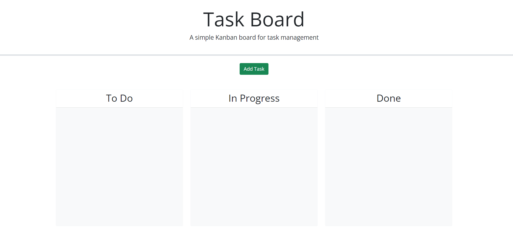
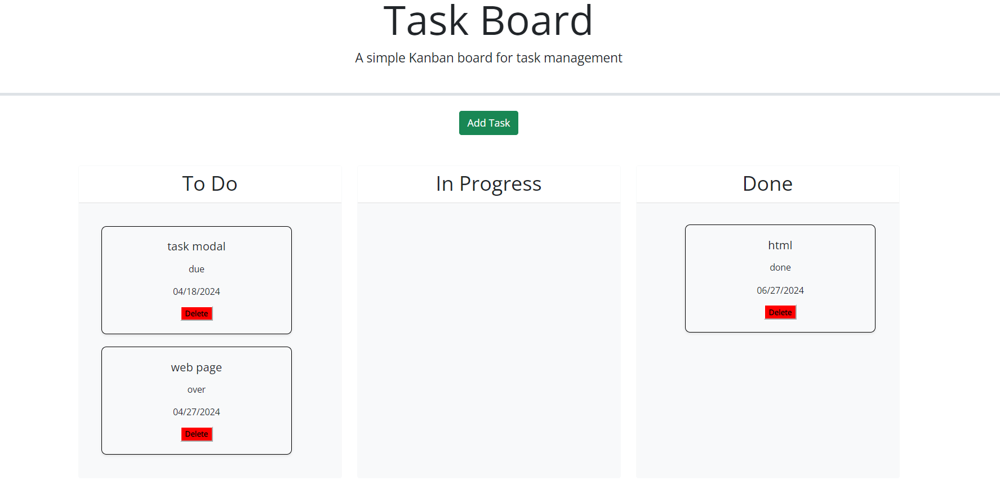

# task-board-challenge-05

## Description

The reason for this project was to build a webpage for users to be able to stay organized with task that they have. I learned how to store user input into a local storage. I also learned bootstrap to help provide existing templates such as modals and cards so web designers didn't also have to create everything from scratch. I learned jQuery, which helped me be able to drag and drop elements.

## Installation

N/A

## Usage

To use the webpage the user must click the "add task" button. A modal will then open up and the user and input the title of the task, the date in which the task is due, and a decription for the task. A task card will be created and used is able to drag and drop the task card into any of the three columns; to do, in progress, or done. The user can also delete the task card by click the delete button.

## Screenshots

## Deployed Link
https://dameine.github.io/task-board-challenge-05/